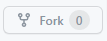
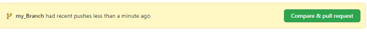
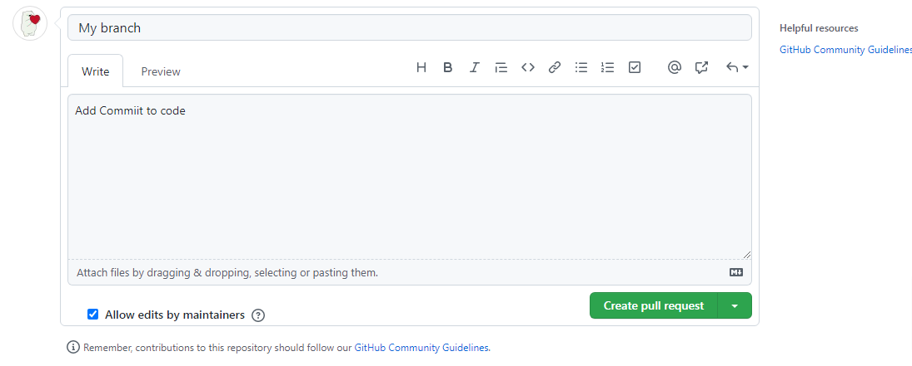
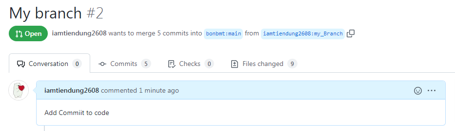

# Python_Final

<h1>1. Virtual Environment </h1>
<h2>1.1. Installing: </h2>
    
<strong>$ python -m venv venv</strong>

<h2>1.2. Using: </h2>
    
Activate: <strong>$ venv\Scripts\activate.bat</strong>

    
Deactivate: <strong>$ venv\Scripts\deactivate.bat</strong>

<h1>2. App and Structures</h1>
<h2>2.1. Create App</h2>
    
<strong>$ cd BookShop</strong>

    
<strong>$ python manage.py startapp AppName</strong>

<h2>2.2. Structure</h2>

    <ol>
    <strong>Self create: </strong>
        <li>templates folder to stores html and templates</li>
        <li>static folder stores static file</li>
        <li>css folder in static folder stores css file</li>
        <li>js folder in static folder stores JavaScript file</li>
        <li>image folder in static folder stores image</li>
    </ol>

<h1>3. Naming Rules</h1>
<h2>3.1. Variable:
</h2>

Using lowercase style to naming variable

<h2>3.2. Function and Class</h2>

Using camelCase or snake_case to naming Function

Class must start with <strong>Upper</strong> case word

Comments bellow each function using <strong>'''Comment'''</strong> syntax

<h2>All the name must have meaning</h2>
<h1>4. Git and Repository</h1>
<h2>4.1. Pull code and clone repository:</h2>
<ol>
    <li>Step 1: Click: </li>
    
    <li>Step 2: open cmd choose right folder</li>
    <li>Step 3: <strong>$ git clone https://github.com/iamtiendung2608/Python_Final.git</strong></li>
    <li>Step 4: <strong>$ git checkout -b new_Branch</strong></li>
    <li>Step 5: After Finish coding:  <strong>$ git add .</strong> </li>
    <li>Step 6: <strong>$ git commit -m "short commit"</strong></li>
    <li>Step 7: <strong>$ git push --set-upstream origin new_Branch</strong></li>
</ol>
<h2>4.2. Pull request: </h2>
<h3>After finish upper step</h3>
<ol>
    <li>Step 1: Compare & pull Request</li>
    
    <li>Write details what you have done clearly in comment section</li>
    
    <li>Finish Commit</li>
    
</ol>
<h3>The rest let me do it</h3>